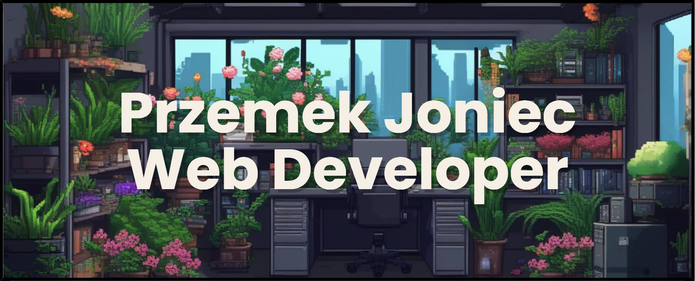

<h2>👋🏼 Hey!</h2>

🌻I'm Przemek Joniec! Passionate Web Developer. 

💻 All of my projects are available at:
- https://github.com/przemekjoniec?tab=repositories
- https://codepen.io/przemekjoniec

☎️ Contact with me:
- <i>✉️ Email:</i> joniecprzemek098@gmail.com
- <i>👾 Discord:</i> lorenzo_malta

<h2>👨🏼‍💻I'm Currently Learning:</h2>

<h2>💻 Tech Stack:</h2>

  

<h2>📊 Stats:</h2>

  

  <b><em>GitHub Stats:</em></b>  
       

<h2>🔍 About Me:</h2>

👨🏼‍🎓 I am a student at a technical school, specializing in IT. 👨🏼‍💻I am fascinated by the world of web development, and I dedicate a lot of time to learning programming and creating websites. Besides that, I have many other passions. 🪴I love plants and spend my free time taking care of them. 🌲I also value being close to nature, so any opportunity to be outdoors is priceless to me. 📖I am interested in history and enjoy watching movies that can captivate me for hours.
 
 
 
